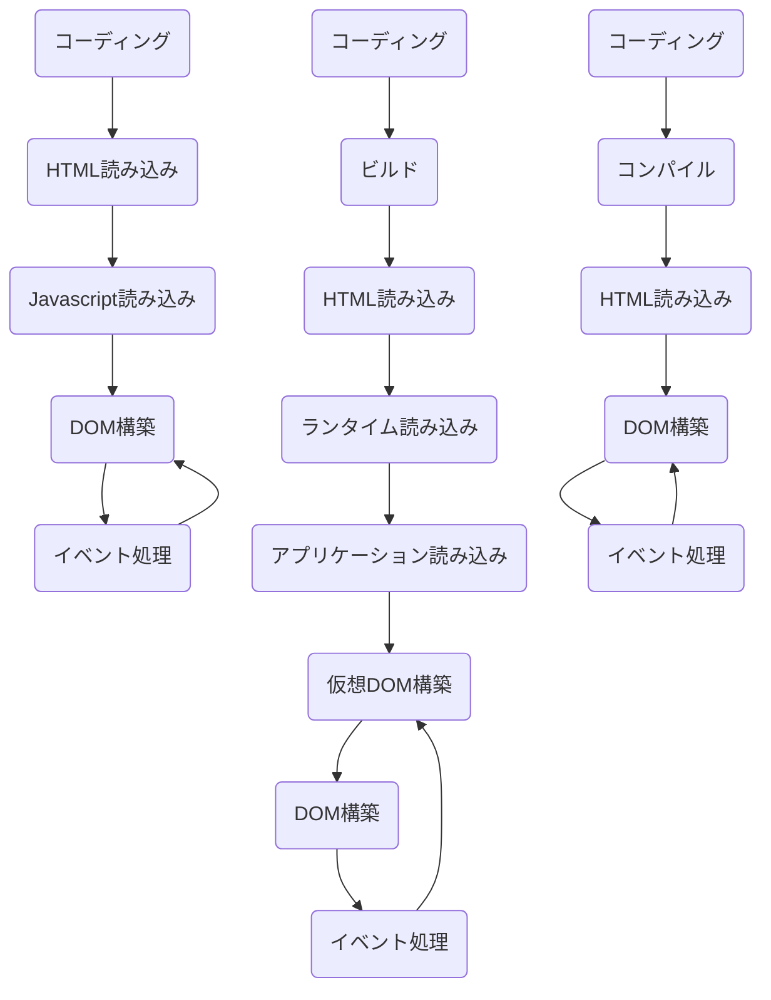

# svelte-demo-app

```mermaid
flowchart TB
    id01(コーディング) --> id02(HTML読み込み) -->  id03(Javascript読み込み) -->  id04(DOM構築) --> id05(イベント処理) --> id04
    id11(コーディング) --> id12(ビルド) --> id13(HTML読み込み) -->  id14(ランタイム読み込み) --> id15(アプリケーション読み込み) --> id17(仮想DOM構築) --> id18(DOM構築) --> id19(イベント処理) --> id17
    id21(コーディング) --> id22(コンパイル) --> id23(HTML読み込み) --> id24(DOM構築) --> id25(イベント処理) --> id24
```
